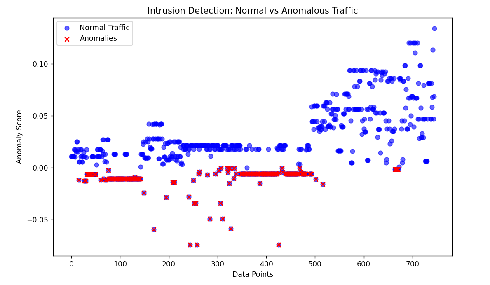
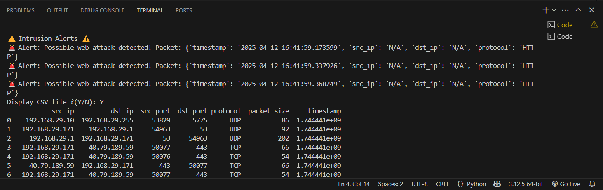

#  Hybrid Intrusion Detection System (HIDS)

A real-time **Hybrid Intrusion Detection System** that combines **signature-based detection** with **machine learning-based anomaly detection** to monitor and flag malicious network activity.

This system captures live network traffic, processes it into structured data, and performs multi-phase detection to identify both known and unknown threats.

---

##  Key Features

-  **Signature-Based Detection:** Matches traffic against predefined threat signatures (IP, protocol, etc.)
-  **Anomaly Detection (ML):** Uses `Isolation Forest` to identify unknown behavioral threats in the network
-  **Real-Time Packet Capture:** Uses `Scapy` and `PyShark` to collect traffic on your network interface
-  **Preprocessing & Feature Engineering:** Cleans and transforms raw `.pcap` into structured numerical data, which is also saved as a `.csv` file for further analysis
-  **Anomaly Visualization:** Clear scatter plots comparing normal vs anomalous traffic
-  **Modular Design:** Each phase is isolated for flexibility, testing, or integration

---

##  How It Works

1. **Capture Traffic**  
   Real-time packet sniffing via `Scapy` and `.pcap` file generation

2. **Extract & Process Features**  
   Converts packets into structured CSV format with timestamps, IPs, ports, size, protocol, etc.

3. **Signature-Based Detection**  
   Compares against known malicious patterns like:
   - IP: `192.168.1.100` → Internal attacker
   - Protocol: `HTTP` → Potential web attack

4. **Anomaly-Based Detection**  
   Trained `IsolationForest` model flags statistically unusual traffic (no labels needed)

5. **Visualization**  
   Optional scatter plot highlighting anomaly scores with red Xs for flagged traffic

---

##  How to Run

###  Install Requirements

```bash
pip install pandas scikit-learn joblib pyshark scapy matplotlib
```

---

###  Run the Full Detection Pipeline

```bash
python main.py
```

This will:
- Capture traffic
- Analyze packets
- Run both detection techniques
- Ask if you want to visualize anomalies

---

###  Train/Update the ML Model

```bash
python Train_model.py
```

- Trains `IsolationForest` on processed network data
- Automatically saves the model as `models/anomaly_detector.pkl`

---

##  Visual Output

###  Anomaly Detection Preview



---

###  Real-Time Detection Output


---

###  Signature-Based Alerts


```
